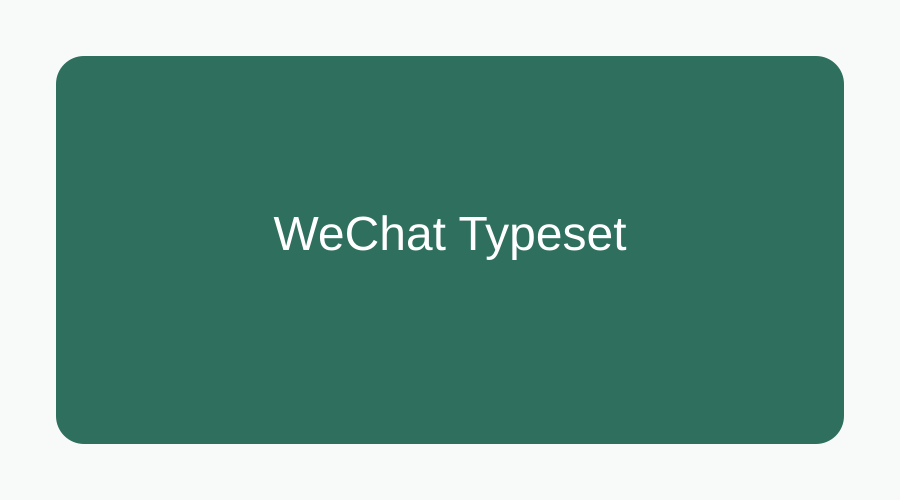

# 测试公众号排版器

这是一段正文，用来确认 **加粗**、*斜体*、[链接](https://example.com) 都能正常渲染。

## 二级标题

> 这是一段引用，用来检查引用样式和行距。

- 第一项
- 第二项
- 第三项

1. 第一步
2. 第二步

### 三级标题



```ts
const message = 'hello wechat';
console.log(message);
```

| 模块 | 推荐参数 |
| --- | --- |
| 正文字号 | 15px |
| 行间距 | 1.75 |

---

注释：这是一段结尾说明。
